# ArchiLudo

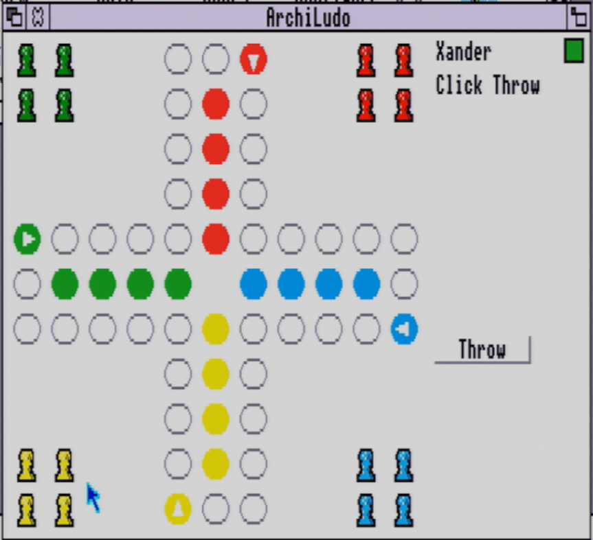

A Ludo ("Mens Erger Je Niet") game for the Acorn Archimedes, targeting
genuine 26-bit RISC OS 3.10. By Xander Mol (idreamtin8bits.com).

## Contents

- [Playing ArchiLudo](#playing-archiludo)
- [Interface manual](#interface-manual)
- [Installation](#installation)
- [Building from source](#building-from-source)
- [Changelog](#changelog)
- [Development history](#development-history)
- [Documentation](#documentation)
- [Credits and licence](#credits-and-licence)

## Playing ArchiLudo

Four players, four pawns each, a shared ring and a short home run per
player -- the classic "Mens Erger Je Niet"/Ludo cross board.

**Starting a game**: on first launch, dismissing the startup splash
screen (**OK**, or click anywhere on it) opens the **New Game**
dialogue directly. Later on, click the iconbar icon to open it again.
Set each of the 4 players' name and whether they're Human or
AI-controlled; an AI-controlled player also gets a **Low**/**Medium**/
**High** difficulty picker (click to cycle) -- see [AI.md](docs/AI.md)
for what each tier actually does. Optionally click **Rules...** to pick
a rule variant or adjust individual house rules (see
[RULES.md](docs/RULES.md) for the full manual), then **Start**.

**Playing a turn**: click **Throw** to roll. The status line tells you
what to do next -- click one of your own pawns on the board if more
than one can legally move (if only one can, it moves automatically),
or click **Throw** again on a six. Landing exactly on another pawn
sends it home; reaching the exact end of your home column finishes
that pawn. For an AI player's turn, click **Continue** to step through
its moves. Every time a player finishes, a win screen appears --
**Continue** (offered for 1st, 2nd, and 3rd place) lets the remaining
players keep going to decide the rest of the placing; the 4th and
final player's screen has no Continue, since nobody's left to play.
Every win screen also offers **New Game** and **Quit Game**.

**Saving and loading**: **Save Game**/**Load Game** from the iconbar
menu open 5 fixed, renamable slots at any time during play.

**Music and sound effects**: open the **Music** submenu (iconbar or
window menu) to turn music **On**/off, turn **SFX** on/off
independently, or pick a **Track**. See [QTM.md](docs/QTM.md) for the
full music/SFX manual (what each track and effect is, and Track 3's
one limitation).

**Rules and variants**: ArchiLudo ships 3 rule presets (Mens Erger Je
Niet, Ludo, Pachisi-style) and 8 individually-adjustable house-rule
toggles. See [RULES.md](docs/RULES.md) for the complete rules manual.

## Interface manual

All screenshots below are from a real Acorn A305 (ARM3, 4MB) over a
PiEconetBridge, not an emulator -- disc name `PIBRIDGE-00` in the
iconbar is the giveaway. This section walks every screen and dialogue
in the order a player actually meets them; see ["Playing
ArchiLudo"](#playing-archiludo) above for the accompanying prose
manual.

### Splash screen

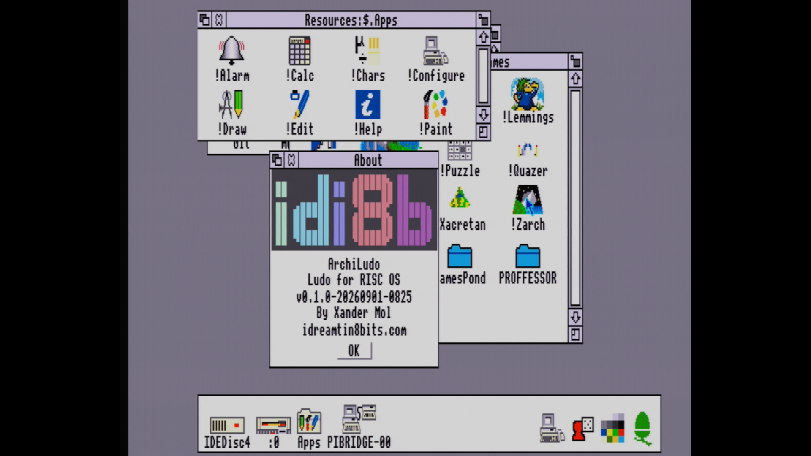

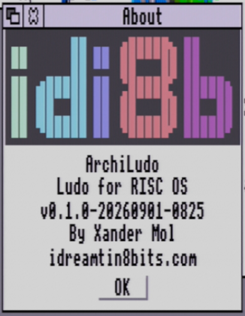

Shown once automatically on startup (and reachable again afterwards
from the iconbar/window menu's **About** entry). Click **OK**, or
anywhere on the window, to dismiss it -- the very first time, this
leads straight into the **New Game** dialogue below.

### New Game dialogue

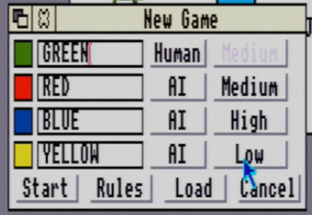

Set each of the 4 players' colour-coded name field and whether
they're **Human** or **AI** (click to toggle). An AI-controlled player
also gets a difficulty picker cycling **Low**/**Medium**/**High**
(shaded out for a Human player, as GREEN's is here) -- see
[AI.md](docs/AI.md) for what each tier actually does.

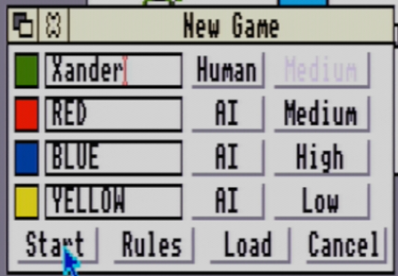

Any name field is freely editable (GREEN renamed to "Xander" here).
**Rules...** opens the Rule Setup dialogue below; **Load** jumps
straight to the Load Game dialogue instead of starting fresh; **Start**
begins play with the configured players and whatever rules are
currently selected.

### Rule Setup dialogue

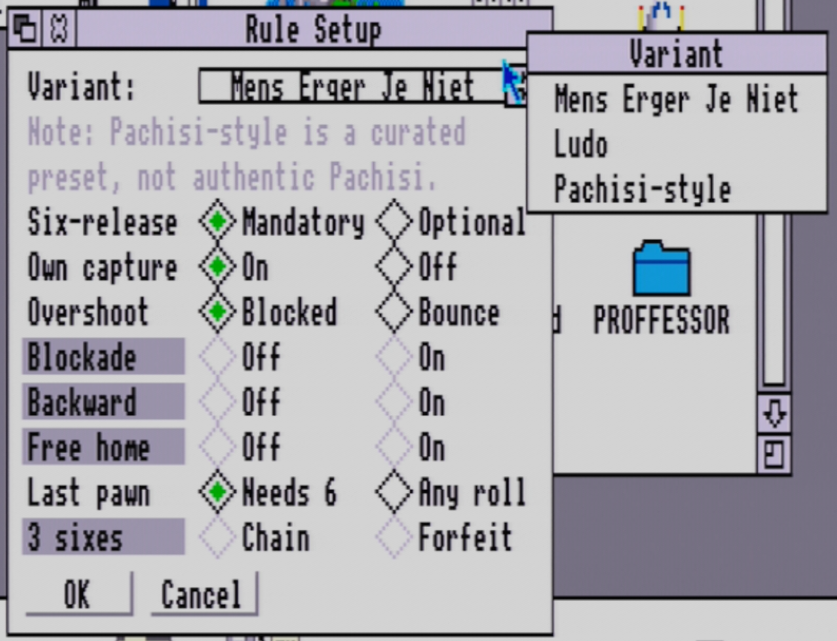

Reached via **Rules...** on the New Game dialogue. The **Variant**
selector picks one of the 3 curated presets (Mens Erger Je Niet, Ludo,
Pachisi-style) and fills in every toggle below to match it; any toggle
can then be adjusted individually, which is what actually happens
under the hood -- a variant is just a starting point, not a locked
mode. See [RULES.md](docs/RULES.md) for exactly what each toggle
changes about play.

### The game window


The board (also shown at the top of this README) fills most of the
window: the shared 40-square ring, each player's 4-pawn home base in a
corner, and their short home column running in from the ring to the
centre. The panel on the right shows the current player's name and
what to do next (**Click Throw**, or a prompt to pick a pawn), plus a
solid colour swatch marking whose turn it is. Click **Throw** to roll;
click one of your own pawns on the board to move it, if more than one
legally can (a single legal pawn moves automatically without a click).

### Menus

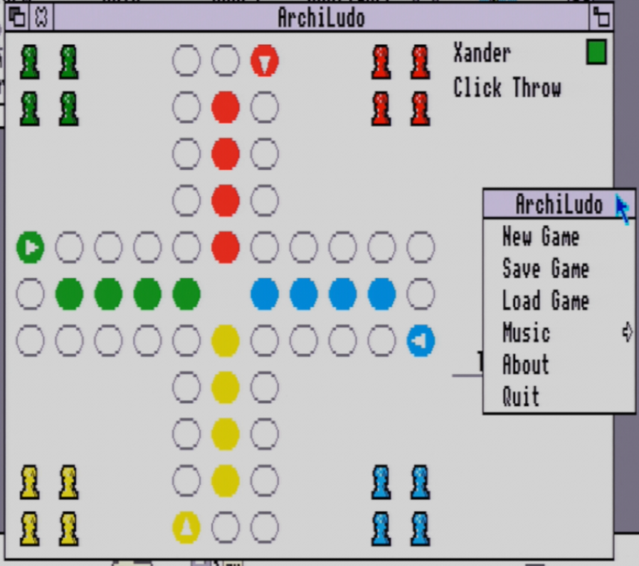

Opened from either the iconbar icon or a click on the game window
itself (both show the same menu). **New Game** and **About** reopen
the dialogues covered above; **Quit** closes ArchiLudo.

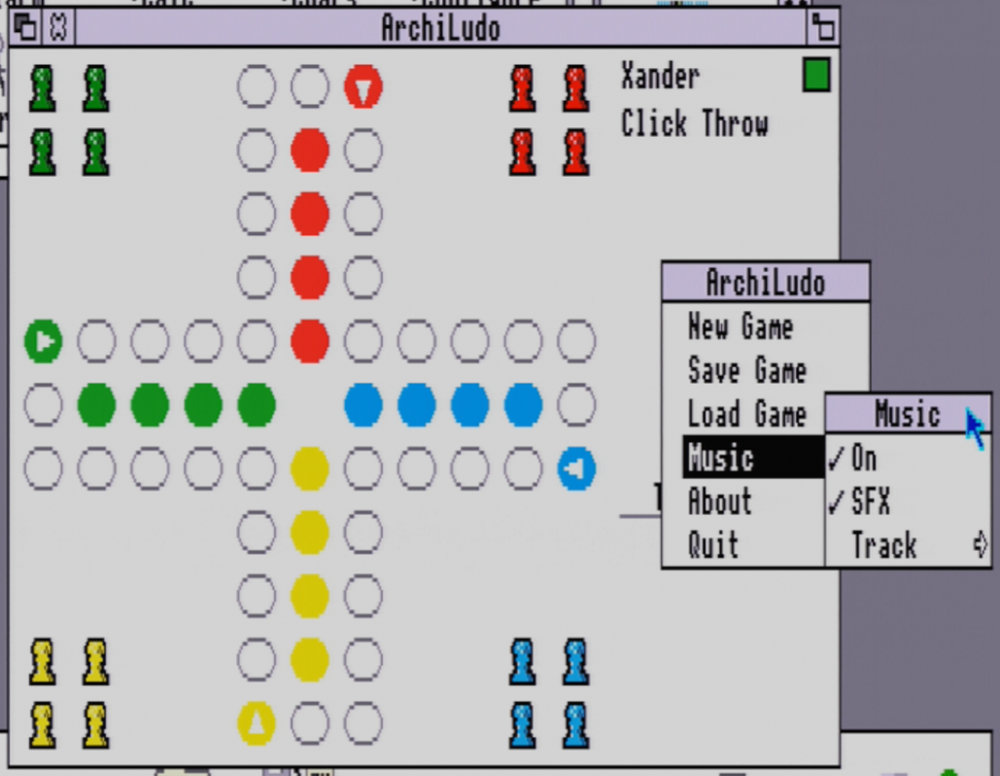

**On** and **SFX** are independent ticked toggles -- music can play
with effects muted, or vice versa. **Track** opens a further submenu
(below) to pick which of the 3 bundled tracks plays.

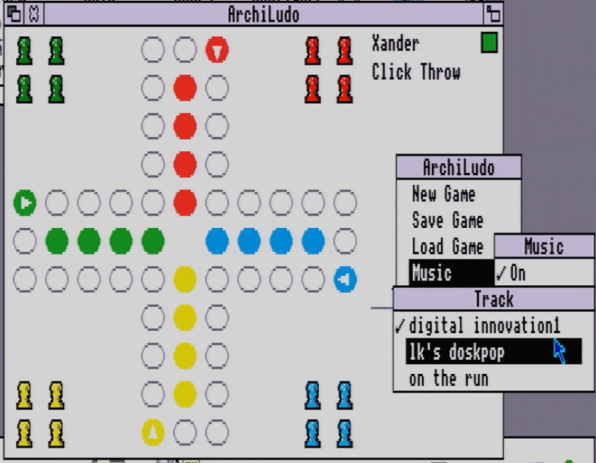

A tick marks the currently-playing track; clicking another switches to
it immediately. See [QTM.md](docs/QTM.md) for what each track and
sound effect is, and Track 3's one limitation.

### Saving and loading

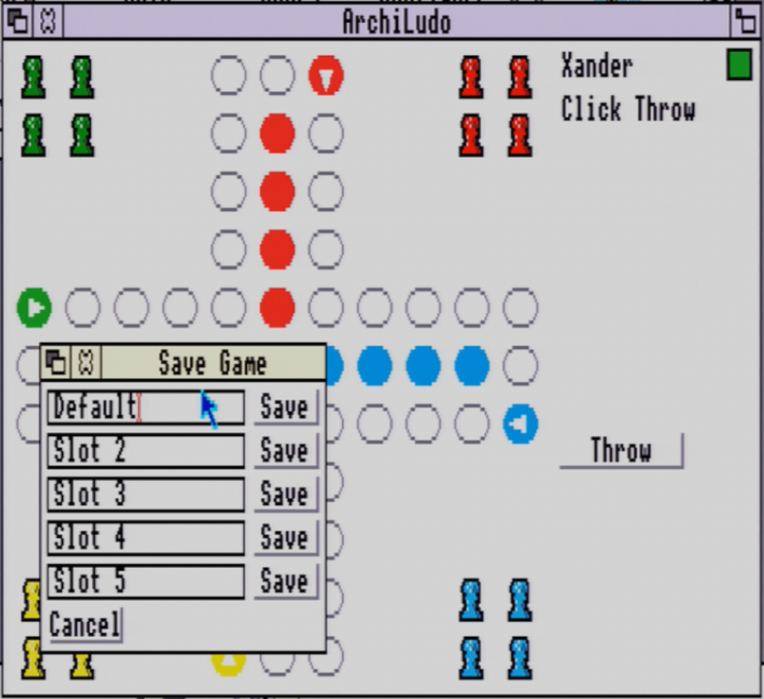

5 fixed slots, each independently renamable by editing its text field
before clicking its own **Save** button -- saving never prompts to
overwrite, since all 5 slots are equally "yours" (no distinction
between a fresh slot and one already in use).

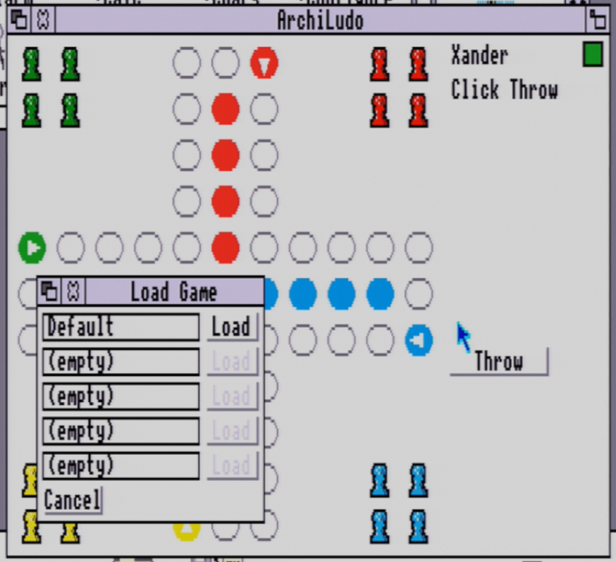

An empty slot shows `(empty)` with its **Load** button shaded, exactly
mirroring the Save dialogue's 5 slots. Reachable both from the
iconbar/window menu and directly from the New Game dialogue's **Load**
button.

### Winning

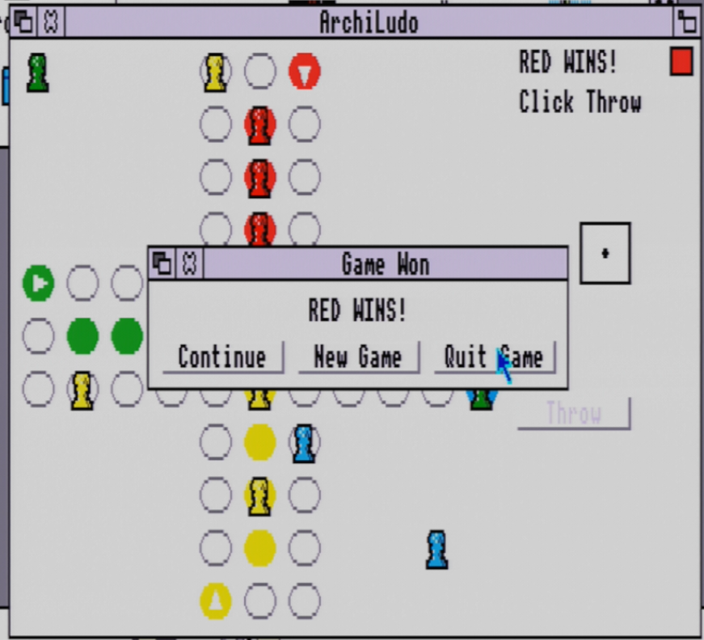

A win screen (with fanfare) appears the moment any player finishes all
4 pawns, showing "\<name\> WINS!" for the first player home and
"\<name\> ended 2nd/3rd/4th" for each place after that. **Continue**
(offered for every place except the last) lets the remaining players
keep going to decide the rest of the finishing order; every win screen
also offers **New Game** and **Quit Game**.

## Installation

**Requires a real or emulated Acorn Archimedes running RISC OS 3.10 or
later** (ARM2 or ARM3). Download a release (`ArchiLudo-vX.Y.Z-*.zip` or
`.adf`) and:

- **Zip**: extract with SparkFS (or any RISC-OS-aware zip tool) --
  filetypes are preserved. Double-click the extracted `!ArchiLudo`
  application directory to run.
- **Disc image** (`.adf`, ADFS "D" format, 800KB): write it to a real
  3.5" floppy, or mount it directly in an emulator that supports raw
  ADFS images. It contains just the release zip, correctly filetyped
  -- extract it the same way as above once it's accessible from RISC
  OS.
- **Real classic-Econet hardware** (a PiEconetBridge or similar
  old-style fileserver): rename the downloaded file to 10 characters
  or fewer with no dot before transferring it (e.g. `ArchiZip` for the
  zip, `ArchiADF` for the disc image) -- such fileservers silently
  truncate longer names in a way that makes the file unreadable, not
  just renamed. Arculator's hostfs and a plain download/extract on
  Windows/Mac/Linux have no such limit.

No installer is needed beyond copying the `!ArchiLudo` directory
wherever you want it -- RISC OS applications are self-contained
directories, not registry entries or system-wide installs.

## Building from source

### Prerequisites

| Tool | Purpose | Install |
|---|---|---|
| [ArchieSDK](https://gitlab.com/_targz/archiesdk) | ARM2-targeting cross-compiler (GCC 8.5.0), bundled OSLib | `git clone https://gitlab.com/_targz/archiesdk.git ~/riscos-dev/archiesdk && cd ~/riscos-dev/archiesdk && ./build.sh` |
| [Arculator](https://arculator.hep.org.uk/) | Acorn Archimedes emulator, for testing | install anywhere; point `ARCULATOR_HOSTFS` in `.env` at its `hostfs` folder (e.g. `D:\Retro\Acorn\Arculator_V2.2_Windows\hostfs` on Windows) |
| pandoc | optional: README.md -> README.pdf | `sudo apt install pandoc texlive-xetex texlive-latex-extra` |
| Python 3 + Pillow | `tools/riscos_sprite.py`, the PNG->Sprite converter | `pip install Pillow` |
| sshpass | optional: `make deploy-pibridge` (real-hardware deploy) | `sudo apt install sshpass` |

### .env setup

Copy `.env.example` to `.env` and set:

```
ARCHIESDK = /home/xahmol/riscos-dev/archiesdk
ARCULATOR_HOSTFS = /mnt/d/Retro/Acorn/Arculator_V2.2_Windows/hostfs
```

`PIBRIDGE_USER`/`PIBRIDGE_HOST`/`PIBRIDGE_PASS`/`PIBRIDGE_PATH` are
also needed for `make deploy-pibridge` (a real PiEconetBridge target)
-- see `.env.example` for the full set. `.env` is gitignored -- never
commit it.

`.env` is read only by `make` (a plain `-include .env` in the
Makefile), not by your shell -- if you use VS Code, `.vscode/c_cpp_properties.json`
points its IntelliSense `compilerPath` at `${env:ARCHIESDK}`, which
needs `ARCHIESDK` exported as a real environment variable separately
(e.g. `export ARCHIESDK=/path/to/archiesdk` in your shell profile, or
launch `code .` from a shell where you've already exported it).

### Make targets

| Target | Effect |
|---|---|
| `make` / `make all` | build the `build/!ArchiLudo` application directory |
| `make test` | build and run the game-logic unit tests with the host compiler (no ArchieSDK/Arculator needed) |
| `make clean` | remove `build/` |
| `make deploy` | copy `build/!ArchiLudo` to the Arculator hostfs folder |
| `make deploy-pibridge` | deploy to a real PiEconetBridge over SSH (password auth) |
| `make zip` | versioned release archive (`build/ArchiLudo-vX.Y.Z-<timestamp>.zip`), RISC OS filetypes preserved |
| `make disk` | ADFS "D" format (800KB) disc image containing the release zip, correctly filetyped |
| `make assets` | regenerate the pawn sprites and app icon from their Python generators |
| `make export-sprites` / `make import-sprites` | round-trip shipped sprites to hand-editable PNGs and back |
| `make docs` | regenerate `README.pdf` via pandoc |
| `make asm` | emit generated ARM assembly for the current sources into `build/` |

See the ["Installation"](#installation) section above for the
10-character filename limit on real classic-Econet hardware --
`make zip`/`make disk` deliberately keep the full version+timestamp in
their own output filenames so multiple local builds can be told apart.

Testing: boot `configs/ArchiLudo-ARM3-4MB.cfg` (matches real ARM3/4MB
hardware) or `configs/ArchiLudo-ARM2-1MB.cfg` (stock ARM2/1MB
compatibility check) in Arculator with the RISC OS 3.10 ROM, then
double-click `!ArchiLudo` from HostFS via the Filer (see
[BUILDCHAIN.md](docs/BUILDCHAIN.md)'s "Application directory" section
for its structure).

## Changelog

ArchiLudo hasn't cut discrete numbered releases yet -- this is a
milestone-level history of what's been built, newest first.

- **Documentation restructuring**: a new [`TOOLS.md`](docs/TOOLS.md)
  manual now covers every standalone `tools/`/`assets/*.py` script
  (usage, requirements, gotchas) in one place; `GRAPHICS_TOOLING.md`'s
  sprite-format/rendering-approach content moved into
  [`ARCHITECTURE.md`](docs/ARCHITECTURE.md) instead of staying a
  separate file, and `BUILDCHAIN.md` now points to `TOOLS.md` rather
  than duplicating each script's own mechanics.
- **Cleanup**: removed dead code -- a vestigial, never-actually-used
  sample-format conversion path in `lib/qtm.c` and the 6 one-shot SFX
  files it was the only reason to ship separately in the app directory
  (embedded into the music tracks' own MOD sample tables now, not
  shipped standalone); and a whole superseded pawn/dice art generator
  (`assets/generate_placeholder_art.py`) whose output nothing actually
  loaded any more, found while writing `TOOLS.md`. Debug file-logging
  (`debug_log()`) is now an opt-in build flag (`make DEBUG_LOG=1`)
  rather than always compiled in, so a default build carries none of
  its tracing strings or per-call file I/O.
- **Captured-pawn animation**: a displaced pawn (capture, own-pawn
  collision) now slides back to its home base instead of teleporting
  there instantly; the capture SFX was also replaced with a more
  expressive sound after two earlier tries read as too quiet or too
  flat in live testing -- see [QTM.md](docs/QTM.md).
- **Full placement flow**: a win screen (with fanfare) now appears for
  every player who finishes, not just the first -- "WINS!" for 1st,
  "ended 2nd/3rd/4th" for the rest, each offering Continue (except the
  last), New Game, and Quit Game.
- **AI difficulty tiers**: Low/Medium/High per AI-controlled player,
  picked in the New Game dialogue -- Low takes only the objectively
  decisive moves (win/finish/capture/progress), Medium is the original
  full heuristic, High adds a genuine one-ply lookahead. See
  [AI.md](docs/AI.md).
- **Launch flow**: the New Game dialogue now opens automatically right
  after dismissing the startup splash screen.
- **Distribution pipeline**: a filetype-preserving release zip
  (`make zip`), a from-scratch ADFS disc-image builder (`make disk`),
  and a real-hardware deploy target over Econet (`make
  deploy-pibridge`) -- all verified against real hardware, not just
  Arculator, including finding and fixing a 10-character filename
  limit on classic-Econet fileservers and a line-ending mismatch in
  the bundled plain-text README.
- **QTM audio**: background music (3 selectable tracks) and 6 one-shot
  sound effects, embedded as MOD instrument samples and triggered via
  `QTM_PlaySample`, independently toggleable, with loudness-normalized
  SFX. Confirmed working on real hardware.
- **Save/load rework**: from a PRM-correct but non-functional (on
  Arculator's HostFS) drag-and-drop design to 5 fixed, renamable save
  slots.
- **Multi-rule-set / house-rule variant system**: 3 curated presets
  (Mens Erger Je Niet, Ludo, Pachisi-style) plus 8 independently
  toggleable house rules, a Rule Options dialogue, and AI support for
  all of them -- see [RULES.md](docs/RULES.md).
- **Win/continue flow**: a win no longer ends the game outright --
  players can continue for runner-up order or start a new game.
- **Sprite art pivot**: from `os_plot` primitives to real
  `Wimp_PlotIcon`-based pawn sprites and a proper application icon,
  plus a hand pixel-editing round-trip workflow for touching up art in
  an external editor.
- **AI opponents and player setup**: a "New Game" dialogue (names,
  Human/AI toggle per player) and a first AI opponent adapted from the
  original GeoLudo edition's own algorithm.
- **Animation and redraw overhaul**: flicker-free small-region
  animation (dice roll, pawn slide, pulsing highlights) via careful
  `Wimp_UpdateWindow` usage.
- **Application directory packaging**: a real `!ArchiLudo` app
  directory with a custom icon, replacing an earlier flat hostfs
  layout.
- **Phase 1: playable core loop**: the WIMP game window, the real
  Mens Erger Je Niet board (ported from the original GEOS edition's
  own coordinate tables), click-to-move, dice, capture/win detection.
- **Build environment**: the ArchieSDK toolchain, Arculator test
  profiles, and this project's full documentation set established.

## Development history

ArchiLudo isn't this game's first outing -- it's the latest in a line
of ports going back over three decades, all by the same author. Full
credits and technical detail for each generation are in
[`CREDITS.md`](CREDITS.md)'s "Porting source" section; this is the
narrative version.

- **1992**: the original, written in Commodore BASIC 7.0 for the
  Commodore 128 in 80-column mode -- "Mens Erger Je Niet" (Dutch for
  "Don't Get Angry, Man", the house-rule variant of Ludo this whole
  family of ports implements), by Xander Mol under the "XAMA Software"
  name. The listing itself still carries its original 1992 copyright
  banner. Source and a working D64 disk image are preserved at
  [`C128/BASIC Original`](https://github.com/xahmol/ludo/tree/main/C128/BASIC%20Original)
  in the [`xahmol/ludo`](https://github.com/xahmol/ludo) repository.
- **2020**: rewritten for the Oric Atmos, in BASIC.
- **2021**: rewritten a further three times -- the Oric Atmos version
  again, now in C via CC65; a new C port for the TI-99/4a via
  TMS9900-GCC; and a new C port for the Commodore 128 via CC65.
- **2023**: **GeoLudo**, a GEOS edition sharing one executable across
  GEOS on the Commodore 64, Commodore 128, and Commodore Plus/4 --
  [`xahmol/ludo/GEOS`](https://github.com/xahmol/ludo/tree/main/GEOS).
  This is ArchiLudo's own direct porting source: its board geometry and
  ring/home-column layout, its pawn and die-face artwork, and its first
  AI opponent all trace back to GeoLudo specifically (see
  `docs/ARCHITECTURE.md`'s GeoLudo-to-ArchiLudo mapping table), even
  though ArchiLudo's own rules engine (`src/game_logic.c`) is a clean
  reimplementation rather than a line-for-line port (see
  `docs/GAME_LOGIC.md` for why).
- **ArchiLudo**: this project -- a native WIMP port for the Acorn
  Archimedes, targeting genuine 26-bit RISC OS 3.10. The house rules
  the 1992 original encoded by hand are now the configurable
  `LUDO_VARIANT_MEJN` preset among three curated variants (see
  [`RULES.md`](docs/RULES.md)), and its own multi-decade thread
  continues in this README's [Changelog](#changelog) above.

## Documentation

See [`docs/`](docs/) for the full project documentation:
[`ARCHITECTURE.md`](docs/ARCHITECTURE.md) (layering, directory
structure, porting notes),
[`RULES.md`](docs/RULES.md) (the full player-facing rules manual),
[`GAME_LOGIC.md`](docs/GAME_LOGIC.md) (rules engine API),
[`BOARD_LAYOUT.md`](docs/BOARD_LAYOUT.md) (board geometry),
[`AI.md`](docs/AI.md) (AI design),
[`QTM.md`](docs/QTM.md) (music/SFX manual and audio API),
[`TOOLS.md`](docs/TOOLS.md) (every standalone asset/build tool, its
usage, and gotchas),
[`BUILDCHAIN.md`](docs/BUILDCHAIN.md) (toolchain, Makefile, distribution),
[`OSLIB.md`](docs/OSLIB.md) and [`LIBARCHIE.md`](docs/LIBARCHIE.md)
(the libraries this project builds against); plus
[`riscos_wimp_reference.md`](riscos_wimp_reference.md) for the WIMP/SWI/
message API reference, and [`CREDITS.md`](CREDITS.md) for everything
this project is built on or derived from.

## Credits and licence

See [`CREDITS.md`](CREDITS.md) for everything ArchiLudo is built on,
ported from, or otherwise sourced from. Licensed under the
[GNU GPLv3](LICENSE).
